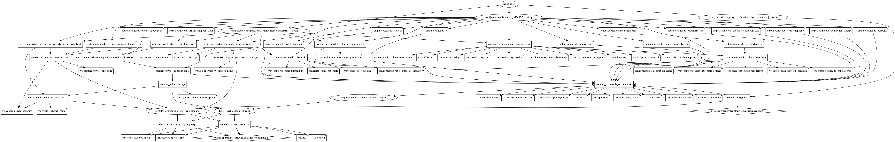

# CosmosDB Account Terraform Module

Azure Cosmos DB is a fully managed platform-as-a-service (PaaS). To use Azure Cosmos DB, initially create an Azure Cosmos account and then databases, containers, items under it. This terraform module helps quickly create a cosmosDB account with cosmosdb table, SQL database and containers resources.

> **[!NOTE]**
> **This module now supports the meta arguments including `providers`, `depends_on`, `count`, and `for_each`.**

## Resources supported

* [CosmosDB Account](https://registry.terraform.io/providers/hashicorp/azurerm/latest/docs/resources/cosmosdb_account)
* [CosmosDB Table within a Cosmos DB Account](https://registry.terraform.io/providers/hashicorp/azurerm/latest/docs/resources/cosmosdb_table)
* [SQL Database within a Cosmos DB Account](https://registry.terraform.io/providers/hashicorp/azurerm/latest/docs/resources/cosmosdb_sql_database)
* [SQL Container within a Cosmos DB Account](https://registry.terraform.io/providers/hashicorp/azurerm/latest/docs/resources/cosmosdb_sql_container)
* [Threat protection for Azure Cosmos DB](https://docs.microsoft.com/en-us/azure/cosmos-db/cosmos-db-advanced-threat-protection?tabs=azure-portal)
* [Private Endpoints](https://www.terraform.io/docs/providers/azurerm/r/private_endpoint.html)
* [Private DNS zone for `privatelink` A records](https://www.terraform.io/docs/providers/azurerm/r/private_dns_zone.html)

## Module Usage

```hcl
#Azure provider Configuration
provider "azurerm" {
  features {}
}

module "cosmosdb" {
  source  = "kumarvna/cosmosdb/azurerm"
  version = "1.0.0"

  # By default, this module will not create a resource group. Location will be same as existing RG.
  # proivde a name to use an existing resource group, specify the existing resource group name, 
  # set the argument to `create_resource_group = true` to create new resrouce group.
  resource_group_name   = "rg-shared-westeurope-01"
  location              = "westeurope"

  # Cosmosdb account details.
  # Currently Offer Type supports only be set to `Standard`
  # Specifies the Kind of CosmosDB to create - possible values are `GlobalDocumentDB` and `MongoDB`
  cosmosdb_account = {
    demo-cosmosdb = {
      offer_type = "Standard"
      kind       = "GlobalDocumentDB"
    }
  }

  # `max_staleness_prefix` must be greater then `100000` when more then one geo_location is used
  # `max_interval_in_seconds` must be greater then 300 (5min) when more then one geo_location is used
  consistency_policy = {
    consistency_level       = "BoundedStaleness"
    max_staleness_prefix    = 100000
    max_interval_in_seconds = 300
  }

  # Configures the geographic locations the data is replicated
  # Location prefix (key) must be 3 - 50 characters long, contain only lowercase letters, numbers and hyphens 
  failover_locations = [
    {
      location          = "westeurope"
      failover_priority = 0
      zone_redundant    = true
    },
    {
      location          = "norwayeast"
      failover_priority = 1
      zone_redundant    = true
    }
  ]

  # Azure Cosmos DB automatically takes a full backup of your database every 4 hours
  # Change the default backup interval and the retention period below 
  backup = {
    type                = "Periodic"
    interval_in_minutes = 240
    retention_in_hours  = 8
  }

  # Advanced Threat Protection for Azure Cosmos DB represents an additional layer of protection
  enable_advanced_threat_protection = true

  # Creating Private Endpoint requires, VNet name and address prefix to create a subnet
  # By default this will create a `privatelink.mysql.database.azure.com` DNS zone. 
  # To use existing private DNS zone specify `existing_private_dns_zone` with valid zone name
  # Private endpoints doesn't work If using `subnet_id` to create redis inside a specified VNet.
  enable_private_endpoint       = true
  virtual_network_name          = "vnet-shared-hub-westeurope-001"
  private_subnet_address_prefix = ["10.1.5.0/29"]
  #  existing_private_dns_zone     = "demo.example.com"

  # (Optional) To enable Azure Monitoring for Azure MySQL database
  # (Optional) Specify `storage_account_name` to save monitoring logs to storage. 
  log_analytics_workspace_name = "loganalytics-we-sharedtest2"

  # CosmosDB Firewall Support: Specifies the set of IP addresses / ranges to be included as an allowed list 
  # IP addresses/ranges must be comma separated and must not contain any spaces.
  # Only publicly routable ranges are enforceable through IpRules. 
  # IPv4 addresses or ranges contained in [10.0.0.0/8,100.64.0.0/10,172.16.0.0/12,192.168.0.0/16] not valid.
  # To allow access from azure portal add ["104.42.195.92", "40.76.54.131", "52.176.6.30", "52.169.50.45", "52.187.184.26"]
  # To allow [0.0.0.0] to Accept connections from within public Azure datacenters
  allowed_ip_range_cidrs = [
    "49.204.226.198",
    "1.2.3.4",
    "0.0.0.0",
    "104.42.195.92",
    "40.76.54.131",
    "52.176.6.30",
    "52.169.50.45",
    "52.187.184.26"
  ]

  # Tags for Azure Resources
  tags = {
    Terraform   = "true"
    Environment = "dev"
    Owner       = "test-user"
  }
}
```

### Resource Group

By default, this module will not create a resource group and the name of an existing resource group to be given in an argument `resource_group_name`. If you want to create a new resource group, set the argument `create_resource_group = true`.

> [!NOTE]
> *If you are using an existing resource group, then this module uses the same resource group location to create all resources in this module.*

## **`key_vault_key_id`** -  Configure customer-managed keys with Azure Key Vault

Data stored in your Azure Cosmos account is automatically and seamlessly encrypted with keys managed by Microsoft (service-managed keys). Optionally, you can choose to add a second layer of encryption with keys you manage (customer-managed keys).

> [!NOTE]
> Currently, customer-managed keys are available only for new Azure Cosmos accounts. You should configure them during account creation.
> When referencing an `key_vault_key_id` in the module, use `versionless_id` instead of `id`

## **`consistency_policy`** - Consistency levels in Azure Cosmos DB

Distributed databases that rely on replication for high availability, low latency, or both, must make a fundamental tradeoff between the read consistency, availability, latency, and throughput as defined by the PACLC theorem. Azure Cosmos DB offers five well-defined levels. From strongest to weakest, the levels are: Strong, Bounded staleness, Session, Consistent prefix, Eventual. The consistency levels are region-agnostic and are guaranteed for all operations regardless of the region from which the reads and writes are served, the number of regions associated with your Azure Cosmos account, or whether your account is configured with a single or multiple write regions.

This option is not enabled by default and can be included in the terraform plan by specifiing following arguments with `consistency_policy` object.

Name | Description
---- | -----------
`consistency_level`|The Consistency Level to use for this CosmosDB Account - can be either `BoundedStaleness`, `Eventual`, `Session`, `Strong` or `ConsistentPrefix`.
`max_interval_in_seconds`|When used with the Bounded Staleness consistency level, this value represents the time amount of staleness (in seconds) tolerated. Accepted range for this value is `5` - `86400` (1 day). Defaults to `5`. Required when `consistency_level` is set to `BoundedStaleness`.
`max_staleness_prefix`|When used with the Bounded Staleness consistency level, this value represents the number of stale requests tolerated. Accepted range for this value is `10` – `2147483647`. Defaults to `100`. Required when `consistency_level` is set to `BoundedStaleness`.

> [!NOTE]
> `max_interval_in_seconds` and `max_staleness_prefix` can only be set to custom values when `consistency_level` is set to `BoundedStaleness` - otherwise they will return the default values shown above.

## **`geo_location`** - Distribute your data globally

Azure Cosmos DB is a globally distributed database system that allows you to read and write data from the local replicas of your database. Azure Cosmos DB transparently replicates the data to all the regions associated with your Cosmos account.

This option is not enabled by default and can be included in the terraform plan by specifiing following arguments with `failover_locations` object.

Name | Description
---- | -----------
`location`|The name of the Azure region to host replicated data.
`failover_priority`|The failover priority of the region. A failover priority of `0` indicates a write region. The maximum value for a failover priority = (total number of regions - 1). Failover priority values must be unique for each of the regions in which the database account exists. Changing this causes the location to be re-provisioned and cannot be changed for the location with failover priority `0`.
`zone_redundant`|Should zone redundancy be enabled for this region? Defaults to `false`.

## **`capabilities`** - The capability to enable in the CosmosDB

This option is not enabled by default and can be included in the terraform plan by specifiing `capabilities` with a valid list of strings. Accepted values are `AllowSelfServeUpgradeToMongo36`, `DisableRateLimitingResponses`, `EnableAggregationPipeline`, `EnableCassandra`, `EnableGremlin`, `EnableMongo`, `EnableTable`, `EnableServerless`, `MongoDBv3.4` and `mongoEnableDocLevelTTL`.

## **`backup`** - Configure periodic backups

Azure Cosmos DB automatically takes a full backup of your database every 4 hours and at any point of time, only the latest two backups are stored by default. If the default intervals aren't sufficient for your workloads, you can change the backup interval and the retention period using `bakup` object it supports following.

Name | Description
---- | -----------
`type`|The `type` of the backup. Possible values are `Continuous` and `Periodic`. Defaults to `Periodic`.
`interval_in_minutes`|The interval in minutes between two backups. This is configurable only when type is `Periodic`. Possible values are between `60` and `1440`.
`retention_in_hours`|The time in hours that each backup is retained. This is configurable only when type is `Periodic`. Possible values are between `8` and `720`.

## Recommended naming and tagging conventions

Applying tags to your Azure resources, resource groups, and subscriptions to logically organize them into a taxonomy. Each tag consists of a name and a value pair. For example, you can apply the name `Environment` and the value `Production` to all the resources in production.
For recommendations on how to implement a tagging strategy, see Resource naming and tagging decision guide.

>**Important** :
Tag names are case-insensitive for operations. A tag with a tag name, regardless of the casing, is updated or retrieved. However, the resource provider might keep the casing you provide for the tag name. You'll see that casing in cost reports. **Tag values are case-sensitive.**

An effective naming convention assembles resource names by using important resource information as parts of a resource's name. For example, using these [recommended naming conventions](https://docs.microsoft.com/en-us/azure/cloud-adoption-framework/ready/azure-best-practices/naming-and-tagging#example-names), a public IP resource for a production SharePoint workload is named like this: `pip-sharepoint-prod-westus-001`.

## Requirements

| Name | Version |
|------|---------|
| terraform | >= 0.13 |
| azurerm | >= 2.59.0 |

## Providers

| Name | Version |
|------|---------|
| azurerm | >= 2.59.0 |
| random |>= 3.1.0 |
| null | >= 3.1.0 |

## Inputs

Name | Description | Type | Default
---- | ----------- | ---- | -------
`create_resource_group` | Whether to create resource group and use it for all networking resources | string | `"false"`
`resource_group_name`|The name of an existing resource group.|string|`""`
`location`|The location for all resources while creating a new resource group.|string|`""`
`storage_account_name`|The name of the storage account name|string|`null`
`log_analytics_workspace_name`|The name of log analytics workspace name|string|`null`
`Tags`|A map of tags to add to all resources|map|`{}`

## Outputs

Name | Description
---- | -----------
`resource_group_name` | The name of the resource group in which resources are created
`resource_group_location`| The location of the resource group in which resources are created
`storage_account_name`|The name of the storage account

## Resource Graph



## Authors

Originally created by [Kumaraswamy Vithanala](mailto:kumarvna@gmail.com)

## Other resources

* [Azure SQL Database documentation](https://docs.microsoft.com/en-us/azure/sql-database/)

* [Terraform AzureRM Provider Documentation](https://www.terraform.io/docs/providers/azurerm/index.html)
